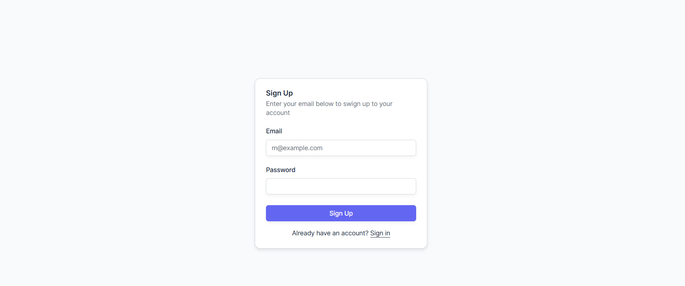
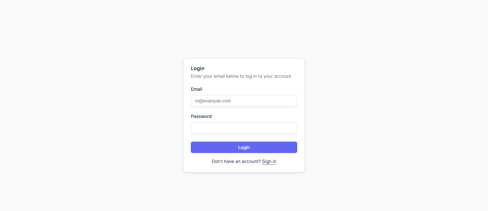
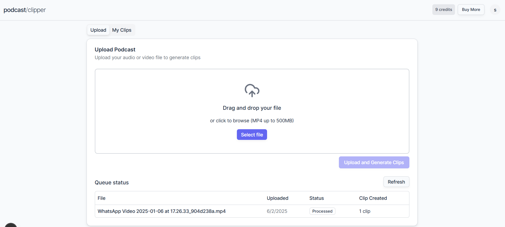
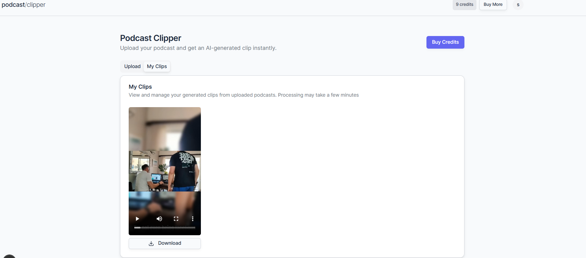

# AI Podcast Clipper

An intelligent podcast clipping tool that automatically generates short, engaging clips from your podcast episodes using AI-powered analysis and transcription.

## Screenshots

### Sign In Page

*Clean and secure authentication interface*

### Login Page  

*Streamlined login experience with multiple provider options*

### Dashboard Upload

*Intuitive podcast upload interface with drag-and-drop functionality*

### Dashboard Clips

*Generated clips management and preview interface*

## Features

- 🎙️ **AI-Powered Clip Generation** - Automatically identify and extract the most engaging moments from your podcasts
- 🎯 **Smart Transcription** - Accurate speech-to-text conversion with speaker identification
- ⚡ **Serverless Processing** - Scalable background processing with Inngest workflows
- 🔐 **Secure Authentication** - Multiple authentication providers via Auth.js
- ☁️ **Cloud Storage** - Reliable file storage and management with AWS S3
- 📱 **Modern UI** - Beautiful, responsive interface built with Shadcn UI components
- 🚀 **Fast Performance** - Optimized with T3 App stack for lightning-fast user experience

## Tech Stack

### Frontend
- **Next.js** - React framework with App Router
- **TypeScript** - Type-safe development
- **Tailwind CSS** - Utility-first CSS framework
- **Shadcn UI** - Modern, accessible UI components
- **T3 App** - Full-stack TypeScript app architecture

### Backend & Processing
- **Python** - Backend API and processing logic
- **Inngest** - Reliable background job processing and workflows
- **Modal** - Serverless GPU compute for AI processing

### Infrastructure
- **AWS S3** - File storage and CDN
- **AWS IAM** - Identity and access management
- **Auth.js** - Authentication and session management
- **Database** - Data persistence and management

## Getting Started

### Prerequisites

- Node.js 18+ 
- pnpm (recommended) or npm
- AWS Account with S3 bucket configured
- Modal account for AI processing
- Inngest account for background jobs

### Environment Variables

Create a `.env` file in the root directory:

```bash
# Database
DATABASE_URL="postgresql://..."

# Auth.js
NEXTAUTH_SECRET="your-nextauth-secret"

# AWS
AWS_ACCESS_KEY_ID="your-aws-access-key"
AWS_SECRET_ACCESS_KEY="your-aws-secret-key"
AWS_REGION="us-east-1"
AWS_S3_BUCKET_NAME="your-s3-bucket-name"

# Modal
PROCESS_VIDEO_ENDPOINT="your-modal-token-id"
PROCESS_VIDEO_ENDPOINT_AUTH="your-modal-token-secret"
```

### Installation

1. Clone the repository:
```bash
git clone https://github.com/ShaneJP-Dev/ai-podcast-clipper.git
cd ai-podcast-clipper
```

2. Install dependencies:
```bash
pnpm install
```

3. Set up the database:
```bash
pnpm db:push
```

4. Start the Python backend (in a separate terminal):
```bash
# Navigate to your Python backend directory
cd backend
pip install -r requirements.txt
python main.py  # or uvicorn main:app --reload for FastAPI
```

5. Start the frontend development server:
```bash
pnpm dev
```

Visit `http://localhost:3000` to see the application.

## Usage

1. **Sign Up/Login** - Create an account or sign in with your preferred provider
2. **Upload Podcast** - Upload your podcast episode (supports MP3, WAV, M4A formats)
3. **AI Processing** - The system automatically transcribes and analyzes your content
4. **Generate Clips** - AI identifies key moments and creates short clips
5. **Download & Share** - Export your clips in various formats for social media

## Architecture

The application follows a modern serverless architecture:

- **Frontend**: Next.js app with server-side rendering and static generation
- **Backend API**: Python-based services for audio processing and business logic
- **Background Processing**: Inngest handles long-running transcription and AI tasks
- **AI Processing**: Modal provides GPU-accelerated computing for audio analysis
- **Storage**: AWS S3 for podcast files and generated clips
- **Database**: Data persistence with secure access controls

## API Endpoints

### Authentication
- `POST /api/auth/signin` - Sign in user
- `POST /api/auth/signout` - Sign out user
- `GET /api/auth/session` - Get current session

### Podcasts (Python Backend)
- `POST /api/podcast/upload` - Upload new podcast
- `GET /api/podcast/list` - Get user's podcasts
- `DELETE /api/podcast/{id}` - Delete podcast

### Clips (Python Backend)
- `GET /api/clips/list` - Get generated clips
- `POST /api/clips/generate` - Generate new clips
- `GET /api/clips/{id}/download` - Download clip

## Contributing

1. Fork the repository
2. Create a feature branch (`git checkout -b feature/amazing-feature`)
3. Commit your changes (`git commit -m 'Add amazing feature'`)
4. Push to the branch (`git push origin feature/amazing-feature`)
5. Open a Pull Request

## Deployment

### Vercel (Recommended)

1. Connect your GitHub repository to Vercel
2. Configure environment variables in Vercel dashboard
3. Deploy automatically on push to main branch

### Manual Deployment

1. Build the application:
```bash
pnpm build
```

2. Start the production server:
```bash
pnpm start
```

## License

This project is licensed under the MIT License - see the [LICENSE](LICENSE) file for details.

## Support

If you encounter any issues or have questions, please [open an issue](https://github.com/ShaneJP-Dev/ai-podcast-clipper/issues) on GitHub.

## Acknowledgments

- Built with the amazing [T3 Stack](https://create.t3.gg/)
- UI components from [Shadcn UI](https://ui.shadcn.com/)
- Background processing powered by [Inngest](https://www.inngest.com/)
- AI processing via [Modal](https://modal.com/)
- Authentication by [Auth.js](https://authjs.dev/)

---
